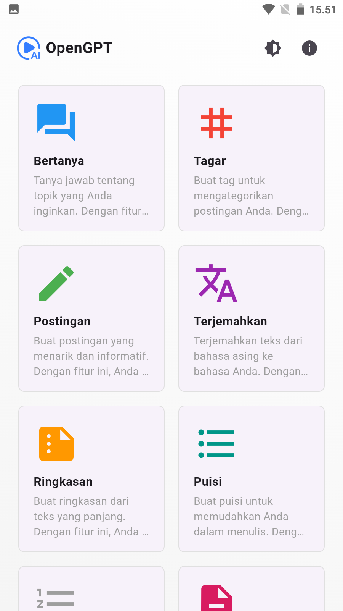
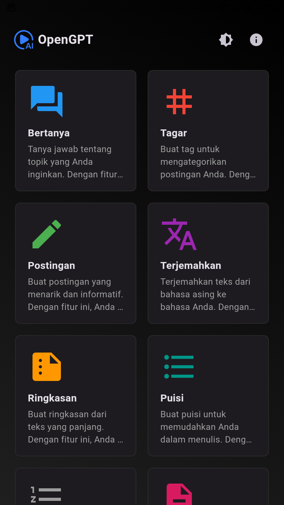
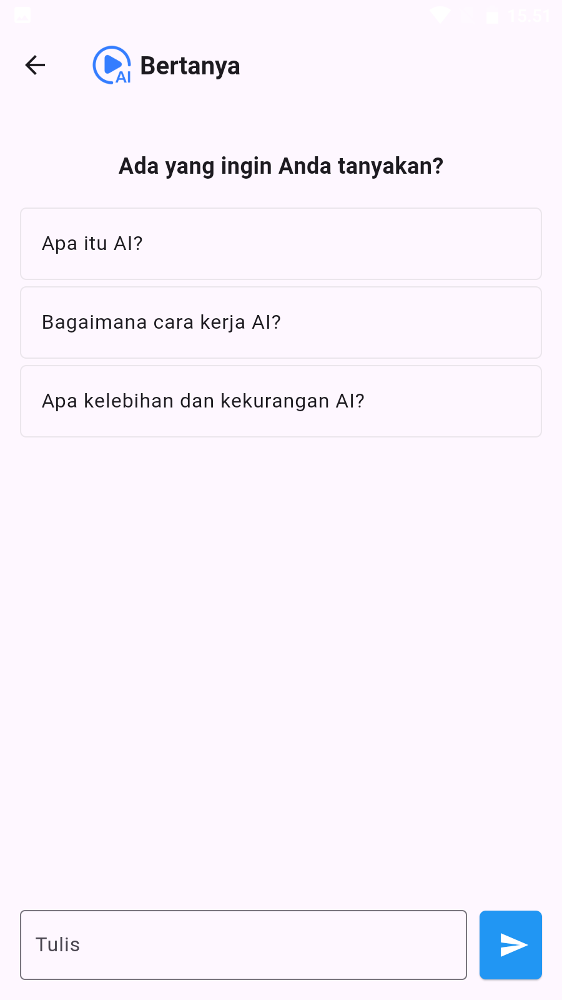
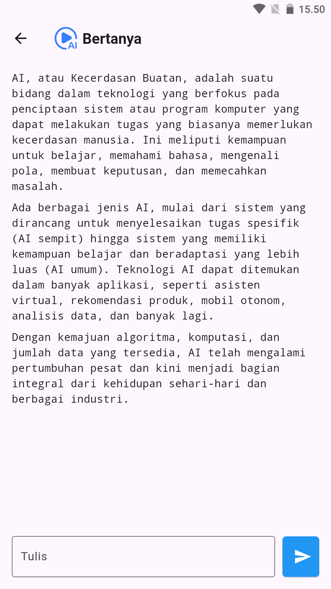

# OpenGPT

Aplikasi Flutter OpenGPT adalah platform berbasis Flutter yang memanfaatkan Text AI untuk memberikan pengalaman interaktif kepada pengguna, sedia 20 fitur terbaik.

## Versi Pengembangan

- Flutter 3.24.2
- Tools • Dart 3.5.2 • DevTools 2.37.2

## Jalankan Program

- `git clone https://github.com/fitri-hy/opengpt-flutter.git`
- `cd opengpt-flutter`
- `flutter pub get`
- `flutter run`

  
  
  
  

